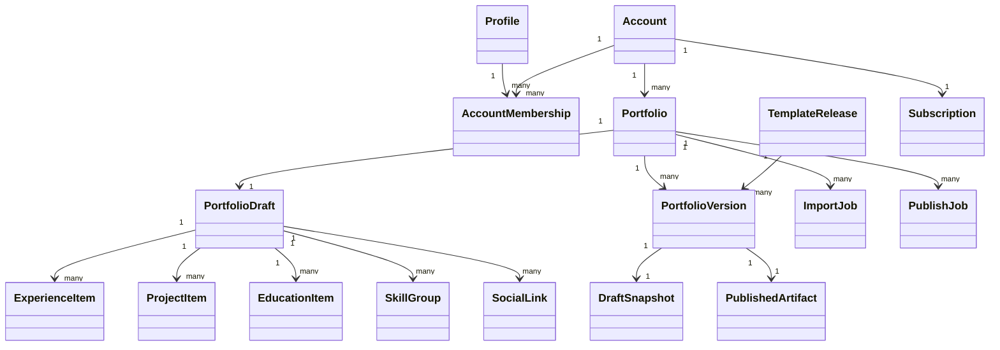

# Animated Resume Data Model And Contracts

Related docs:
- [System Architecture](./2026-04-11-system-architecture.md)
- [Supabase Schema And RLS](./2026-04-11-supabase-schema-and-rls.md)

## Modeling Strategy

The platform keeps one canonical editable model: the normalized portfolio draft. Resume upload, LinkedIn basic identity, and manual editing all map into the same draft shape.

The database can stay relational, but the product should treat the normalized draft contract as the shared interface between:

- import mapping
- verification UI
- structured editors
- preview generation
- template compilation
- publish jobs

## Core Domain Objects

### `Account`

Canonical ownership and billing container.

Responsibilities:

- owns one or more portfolios
- owns subscription and entitlements
- provides future-ready collaboration boundary

### `AccountMembership`

Maps users to accounts and roles.

Responsibilities:

- profile-to-account access
- role assignment
- future collaboration support

### `PortfolioDraft`

Canonical editable portfolio content.

Responsibilities:

- profile basics
- section enablement
- ordered experience items
- ordered project items
- education data
- skill groups
- social links
- theme and motion preferences
- SEO metadata
- completion state

### `TemplateContract`

Compatibility and renderer contract for each internal template release.

Responsibilities:

- supported sections
- required fields
- theme token schema
- motion profile
- tier gating
- compatibility version

### `PublishedArtifact`

Immutable public output created from a draft and template release.

Responsibilities:

- artifact location
- active version state
- subdomain binding
- version metadata
- build metadata

### `DraftSnapshot`

Immutable serialized snapshot of the canonical draft taken at publish time.

Responsibilities:

- captures the exact normalized payload used for publish
- allows version history and rollback without drift
- stores checksum and schema metadata

### `ImportJob`

Tracks transient import-and-mapping processing.

Responsibilities:

- source type
- parsing and mapping status
- confidence summary
- section warnings
- timestamps

### `PublishJob`

Tracks preview and publish execution.

Responsibilities:

- target draft
- template release
- build output
- error states
- job lifecycle timestamps

### `SubscriptionModel`

Captures free and Pro entitlements and future gating.

Responsibilities:

- current tier
- status
- billing lifecycle metadata
- entitlements

## High-Level Relationships



## Canonical JSON Contract

```json
{
  "schemaVersion": "1.0",
  "portfolioId": "uuid",
  "profile": {
    "fullName": "string",
    "headline": "string",
    "location": "string",
    "summary": "string",
    "email": "string|null",
    "phone": "string|null",
    "website": "string|null",
    "avatarAssetId": "uuid|null"
  },
  "theme": {
    "templateKey": "string",
    "accentPreset": "editorial-blue",
    "motionLevel": "minimal"
  },
  "sections": {
    "hero": { "enabled": true, "variant": "default" },
    "about": { "enabled": true },
    "experience": { "enabled": true },
    "projects": { "enabled": true },
    "education": { "enabled": true },
    "skills": { "enabled": true },
    "contact": { "enabled": true }
  },
  "experience": [
    {
      "id": "uuid",
      "company": "string",
      "role": "string",
      "location": "string|null",
      "employmentType": "full-time",
      "startDate": "YYYY-MM",
      "endDate": "YYYY-MM|null",
      "isCurrent": false,
      "summary": "string",
      "highlights": ["string"]
    }
  ],
  "projects": [
    {
      "id": "uuid",
      "name": "string",
      "tagline": "string|null",
      "description": "string",
      "highlights": ["string"],
      "skills": ["string"],
      "links": [
        { "label": "Live", "url": "https://example.com" }
      ],
      "mediaAssetIds": ["uuid"],
      "featured": true
    }
  ],
  "education": [
    {
      "id": "uuid",
      "institution": "string",
      "program": "string",
      "startDate": "YYYY-MM|null",
      "endDate": "YYYY-MM|null",
      "summary": "string|null"
    }
  ],
  "skills": {
    "featured": ["React", "Node.js"],
    "groups": [
      {
        "label": "Frontend",
        "items": ["React", "TypeScript"]
      }
    ]
  },
  "links": [
    {
      "type": "linkedin",
      "label": "LinkedIn",
      "url": "https://linkedin.com/in/example"
    }
  ],
  "seo": {
    "title": "string",
    "description": "string",
    "ogImageAssetId": "uuid|null"
  },
  "metadata": {
    "sourceType": "resume|linkedin-basic|manual",
    "sourceConfidence": 0.82,
    "lastVerifiedAt": "ISO-8601",
    "completionScore": 74
  }
}
```

## Import Mapping Rules

- Resume upload and LinkedIn basic identity are transient import sources
- Import output should be mapped into the canonical contract immediately
- Persist only mapped normalized data plus lightweight metadata
- Confidence should exist at least at section level; field-level confidence is preferred
- Verification UI should surface low-confidence sections first

## Template Contract

Recommended template release shape:

```json
{
  "templateKey": "editorial-starter",
  "releaseVersion": "1.0.0",
  "tier": "free",
  "supportedSections": ["hero", "about", "experience", "projects", "skills", "contact"],
  "requiredFields": ["profile.fullName", "profile.headline", "projects[0].name"],
  "themeTokens": {
    "accentPreset": ["editorial-blue", "neutral-stone"],
    "surfaceMode": ["light", "dark"],
    "motionProfile": ["minimal", "balanced"]
  },
  "compatibility": {
    "minSchemaVersion": "1.0",
    "maxSchemaVersion": "1.x"
  }
}
```

## Publish Contract

`PortfolioVersion` should capture:

- portfolio id
- draft snapshot id
- draft schema version
- template release id
- version number
- status
- created by
- publish timestamp
- live activation state

`DraftSnapshot` should capture:

- snapshot id
- portfolio id
- captured from draft id
- normalized draft payload
- schema version
- checksum
- created at

`PublishedArtifact` should capture:

- artifact id
- version id
- manifest path
- asset bundle path
- public URL metadata
- cache key or invalidation token
- build checksum

## Import Job Contract

Recommended fields:

- `id`
- `portfolioId`
- `sourceType`
- `status`
- `confidenceSummary`
- `sectionWarnings`
- `startedAt`
- `completedAt`
- `errorCode`
- `errorMessage`

## Publish Job Contract

Recommended fields:

- `id`
- `portfolioId`
- `draftId`
- `templateReleaseId`
- `status`
- `artifactId`
- `previewMode`
- `startedAt`
- `completedAt`
- `errorCode`
- `errorMessage`

## Subscription Model

Recommended entitlements model:

- `canPublishHostedPortfolio`
- `canRemoveBranding`
- `canUsePremiumTemplates`
- `canViewAdvancedAnalytics`
- `canUseCustomDomain`
- `canUseMultiplePortfolios`

Launch defaults:

- Free: hosted portfolio, starter templates, branding on, basic analytics, one visible portfolio
- Pro: premium templates, branding removal, richer analytics, future path to custom domains and multi-portfolio UX

Subscriptions belong to accounts, not profiles. In phase 1, each user receives one default personal account at signup.

## Naming Rules

- Use `draft` for editable content
- Use `version` for a publish attempt output record
- Use `artifact` for immutable public output
- Use `template release` for a versioned renderer package
- Avoid mixing `site`, `page`, `resume`, and `portfolio` interchangeably in the persistence layer
