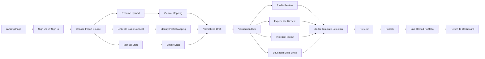
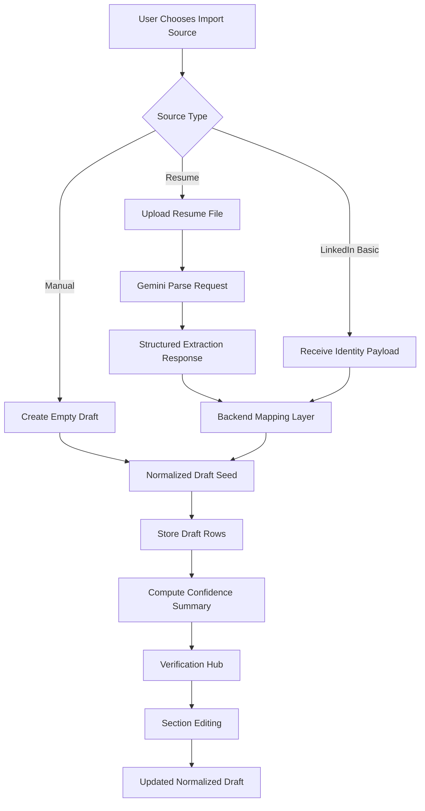
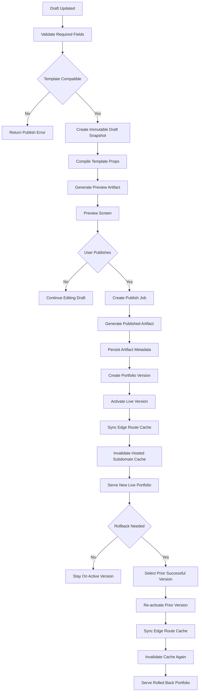
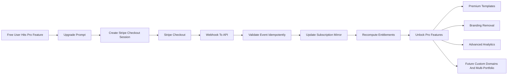
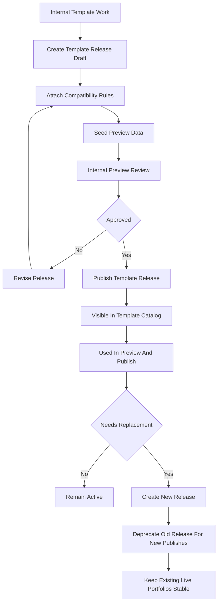
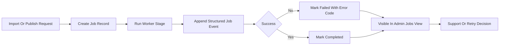
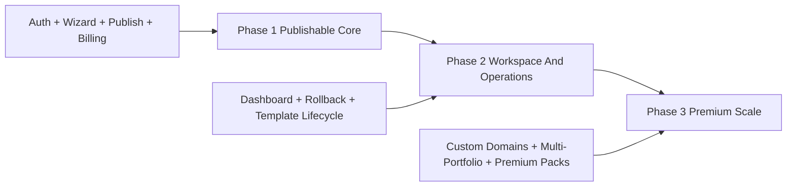

# Animated Resume Flow Diagrams

Related docs:
- [System Architecture](./2026-04-11-system-architecture.md)
- [Data Model And Contracts](./2026-04-11-data-model-and-contracts.md)
- [Publish Pipeline](./2026-04-11-publish-pipeline.md)
- [Phased Execution Roadmap](../product/2026-04-11-phased-execution-roadmap.md)

This document consolidates the major product and platform flows into Mermaid diagrams so the delivery model, user lifecycle, and operational paths are easy to review without reading the full spec line-by-line.

## 1. User Journey: First Visit To Live Portfolio

## 2. Import And Normalization Flow

## 3. Draft, Preview, Publish, And Rollback Flow

## 4. Billing And Entitlement Flow

## 5. Admin Template Release Lifecycle

## 6. Operational Job Visibility Flow

## 7. Phase Delivery Flow

## Usage Notes

- Use these diagrams as the visual companion to the architecture and roadmap docs.
- Keep terminology aligned with the canonical contract docs:
  - `draft`
  - `template release`
  - `portfolio version`
  - `published artifact`
- Update this file whenever a flow changes in a way that impacts product behavior or operational ownership.
