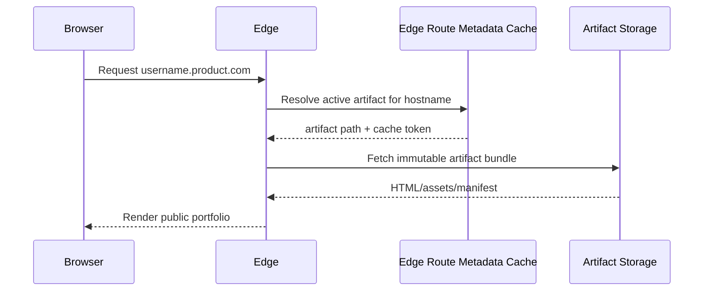

# Animated Resume Publish Pipeline

Related docs:
- [System Architecture](./2026-04-11-system-architecture.md)
- [Data Model And Contracts](./2026-04-11-data-model-and-contracts.md)

## Pipeline Summary

Publishing is the core runtime capability of Animated Resume.

The platform does not render public portfolios directly from the live draft tables. Instead, it compiles a normalized draft into a versioned, immutable public artifact bundle and then switches the live portfolio to that artifact.

## Publish Lifecycle

```mermaid
flowchart LR
    A[Draft Updated] --> B[Preview Request]
    B --> C[Validation]
    C --> D[Create Immutable Draft Snapshot]
    D --> E[Template Binding]
    E --> F[Compile Template Props]
    F --> G[Generate Artifact Bundle]
    G --> H[Store Artifact Metadata]
    H --> I[Create Portfolio Version]
    I --> J[Activate Version]
    J --> K[Sync Edge Route Cache]
    K --> L[Invalidate Cache]
    L --> M[Live Hosted Subdomain]
```

## Stages

### 1. Draft ready

Input:

- current normalized draft
- assigned template release
- theme and motion settings

Checks:

- required fields present
- supported sections only
- no entitlement violations

### 2. Preview

Preview should use the same template compilation path as publish, but the artifact should remain non-live and disposable.

Preview output:

- temporary preview artifact
- preview URL or embedded preview reference

### 3. Publish validation

Before generating a live version, the API should verify:

- draft is valid enough to publish
- template release is compatible with the draft schema version
- user has access to the chosen template
- portfolio slug or subdomain binding is valid

### 4. Draft snapshot creation

Before publish compilation, persist an immutable `draft_snapshot` that captures the exact normalized draft payload used for the publish.

Required fields:

- captured from draft id
- normalized json payload
- schema version
- checksum

This snapshot becomes the historical source for the portfolio version and prevents old published versions from drifting when the mutable draft changes later.

### 5. Template compilation

The backend resolves:

- template release package
- canonical draft contract
- theme token selection
- section enablement
- motion profile

It then produces strongly typed template props.

### 6. Artifact generation

Artifact output should include:

- manifest file
- page content payloads
- asset references
- metadata for cache keys and version checks

The output must be immutable once stored.

### 7. Version creation

Create a new `portfolio_versions` record and attach the generated artifact metadata.

Version should remain non-live until artifact persistence and integrity checks succeed.

The version must reference the immutable `draft_snapshot_id`, not the mutable active draft row.

### 8. Activation

On successful artifact persistence:

- mark the version active
- update subdomain binding source-of-truth records to the new artifact
- preserve previous active version for rollback

### 9. Route cache sync and cache invalidation

After activation:

- sync the active route metadata into the edge route cache
- invalidate or rotate the public cache key so requests to the hosted subdomain resolve to the new active artifact without request-time Postgres reads

## Runtime Resolution

The edge route cache is populated from source-of-truth route records during publish activation and rollback. Public requests should not go to Postgres directly on the hot path.

## Rollback Model

Rollback should be operationally simple:

- select a previous successful `portfolio_version`
- mark it active
- update active artifact pointer
- sync the edge route cache
- invalidate caches

Rollback must not trigger a full rebuild unless asset integrity is broken or artifacts are missing.

## Failure Handling

### Import failures

- user sees actionable error state
- admin sees job details
- no partial publish state created

### Validation failures

- publish blocked
- missing-field or incompatible-template errors returned clearly
- active version unchanged

### Artifact generation failures

- publish job marked failed
- active version unchanged
- temporary preview artifacts cleaned up on schedule

### Activation failures

- artifact may exist, but live pointer must not switch until activation completes
- retry should be safe and idempotent

## Preview Versus Publish

Preview and publish should share most of the compilation code path.

Difference:

- preview output is temporary and non-live
- publish output is versioned, persisted, and activation-capable

This keeps the preview faithful to the live outcome.

## Observability

Track structured events for:

- preview requested
- preview generated
- publish started
- publish validated
- artifact generated
- artifact stored
- version activated
- cache invalidated
- publish failed

Admin should be able to inspect publish jobs by portfolio, user, and template release.

## Compatibility Rules

- template release declares supported schema versions
- publish must fail fast on incompatible template release
- deprecated template releases may remain valid for old live versions but be blocked for new publishes
- template release changes must not silently break older active versions

## Cost And Scalability Benefits

The published-artifact model improves:

- read scalability
- CDN caching
- public performance
- version rollback
- cost predictability under traffic spikes

It also reduces the risk of public pages depending on draft-only API behavior.
