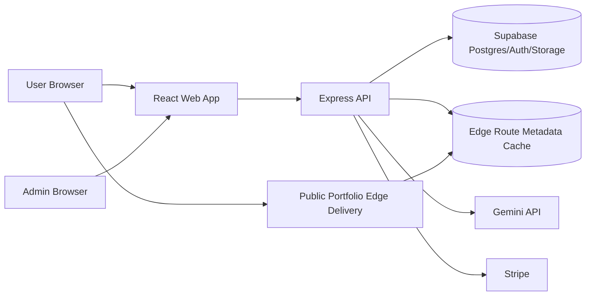
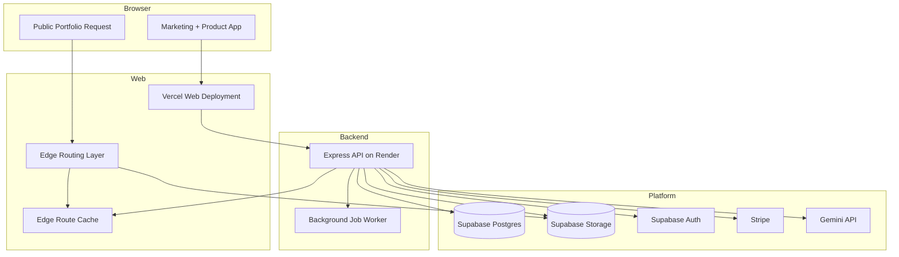

# Animated Resume System Architecture

Related docs:
- [Platform Design Spec](../specs/2026-04-11-animated-resume-platform-design.md)
- [Flow Diagrams](./2026-04-11-flow-diagrams.md)
- [Data Model And Contracts](./2026-04-11-data-model-and-contracts.md)
- [Publish Pipeline](./2026-04-11-publish-pipeline.md)

## Overview

Animated Resume uses a split architecture:

- React web shell for marketing and authenticated product flows
- Express API for orchestration, import handling, draft editing, publishing, billing, and admin workflows
- Supabase for auth, Postgres, storage, and tenant isolation
- Versioned published artifacts for public portfolio delivery

The system deliberately separates `editing runtime` from `public delivery runtime`. This is the central architectural decision of the product.

## System Context

## Runtime Responsibilities

### React web app

- Marketing site
- Authentication entry
- Guided onboarding wizard
- Structured editors
- Preview surface
- Billing UI
- Analytics UI
- Admin UI

The web app should not contain business-critical publish orchestration logic. It is a client of the backend contract.

### Express API

- Auth session orchestration with Supabase
- Resume upload intake
- Gemini parsing orchestration
- LinkedIn basic identity prefill coordination
- Draft CRUD
- Template catalog and entitlement checks
- Preview generation
- Publish orchestration
- Billing checkout and webhooks
- Admin operations
- Analytics aggregation endpoints

### Supabase

- User authentication
- User and portfolio data
- Template metadata storage
- Published artifact metadata
- Uploaded media storage
- Aggregate analytics records

### Public edge delivery

- Resolve hosted subdomain through edge-accessible route metadata cache
- Read active published artifact metadata
- Serve immutable public artifact bundle
- Apply caching and invalidation based on active version changes

Public requests should not query Postgres directly on the hot path. Postgres remains the source of truth for route bindings, but active route metadata should be mirrored into a fast edge-readable cache during publish activation.

## Deployment Topology

## Public Versus Authenticated Traffic Split

### Authenticated product traffic

- Higher write frequency
- Requires authorization and draft persistence
- Tolerates richer application logic
- Uses API heavily

### Public portfolio traffic

- Mostly read-heavy
- Must be fast and cacheable
- Should not rely on editor-side database joins on every request
- Should resolve to the active immutable published version

This separation is why the product uses published artifacts instead of live-rendered database pages.

## Application Structure Recommendation

Use a TypeScript monorepo with clear ownership boundaries.

Recommended shape:

- `apps/web`
- `apps/api`
- `packages/contracts`
- `packages/ui`
- `packages/templates`
- `packages/config`
- `supabase/`
- `docs/`
- `plans/`

This keeps React, Express, shared contracts, and template packages aligned without making templates a special-case runtime.

## Admin Surface

Admin should run inside the same React product shell but behind explicit role and route boundaries.

Admin responsibilities:

- User support visibility
- Template catalog and release management
- Publish and import job monitoring
- Billing overview
- Feature flag controls

Admin should not require direct database-console access for normal operations.

## Operational Boundaries

### API boundary

The API owns:

- validation
- orchestration
- entitlement checks
- version activation
- publish state changes
- synchronization of route metadata from source-of-truth records into the edge route cache

### Contract boundary

Shared contracts own:

- normalized draft types
- template release compatibility types
- publish job types
- import job types
- subscription entitlement types

### Template boundary

Templates own:

- presentation logic
- section support
- theme tokens
- motion presets

Templates do not own:

- user authorization
- raw import handling
- billing
- publishing state

## Reliability And Safety Constraints

- Publish must be asynchronous and idempotent
- Billing webhooks must be idempotent
- Publish must not replace the active version until the new artifact succeeds validation and persistence
- Public route resolution must not depend on request-time Postgres reads
- Background jobs must emit structured logs and statuses
- Import and publish errors must be inspectable in admin
- Template compatibility must be checked before publish

## Key Decisions Locked

- Hosted subdomains at launch
- Draft plus publish lifecycle
- Normalized draft retention only
- Guided wizard for initial authoring
- Internally curated templates
- Freemium plus Pro from phase 1
- Multi-portfolio-ready schema with delayed launch UX exposure
