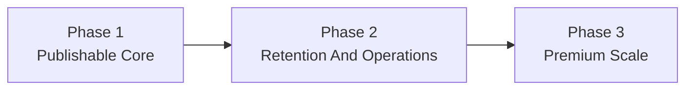

# Animated Resume Phased Execution Roadmap

Related docs:
- [Platform Design Spec](../specs/2026-04-11-animated-resume-platform-design.md)
- [System Architecture](../architecture/2026-04-11-system-architecture.md)
- [Flow Diagrams](../architecture/2026-04-11-flow-diagrams.md)
- [`plans/`](../../plans/)

## Roadmap Summary

The product should be built in controlled phases. Each phase must leave the system in a usable, production-safe state rather than serving as an internal prototype checkpoint.

## Phase Map

## Phase 1: Publishable Core

### Goal

Launch a monetizable product where a user can import, verify, template, preview, publish, and maintain one hosted portfolio.

### In scope

- Monorepo foundation
- React marketing and product shell
- Express API
- Supabase bootstrap
- Auth
- Guided onboarding wizard
- Resume upload and Gemini normalization
- LinkedIn basic identity prefill
- Structured section editors
- Template catalog
- Preview flow
- Publish jobs and active version switching
- Hosted subdomains
- Free and Pro billing
- Basic analytics
- Admin basics

### Entry criteria

- Product decisions locked
- Data contract locked
- Publishing model locked
- UI shell language locked

### Exit criteria

- User can create account, complete onboarding, preview, and publish
- Hosted subdomain serves active artifact
- Free/Pro entitlements work
- Admin can inspect import and publish jobs
- Core mobile and accessibility checks pass

## Phase 2: Workspace And Retention

### Goal

Improve long-term usability, retention, and operational maturity without replacing the phase 1 authoring model.

### In scope

- Better dashboard
- Version history and rollback UX
- Improved media handling
- More templates
- Better analytics surfaces
- Lifecycle nudges and upgrade prompts
- Stronger admin template lifecycle controls
- Better error recovery and observability

### Entry criteria

- Phase 1 stable in production
- Publish job reliability acceptable
- Support issues mapped
- Billing funnel visible enough to optimize

### Exit criteria

- Users can republish confidently
- Admin can manage template releases without database-console dependency
- Template changes are compatibility-aware
- Retention and upgrade surfaces exist inside the product

## Phase 3: Premium Scale

### Goal

Expand monetization, distribution credibility, and creator-grade capabilities while protecting the phase 1 simplicity of the product shell.

### In scope

- Custom domains
- Visible multi-portfolio Pro experience
- Premium template packs
- Premium motion packs
- Advanced SEO
- Better lead capture and analytics
- Optional studio-style authoring enhancements

### Entry criteria

- Strong enough phase 1 and 2 activation and retention
- Stable template lifecycle
- Support confidence for hosted portfolios
- Clear upgrade demand from existing users

### Exit criteria

- Premium capabilities are differentiated and supportable
- Custom-domain flow is reliable
- Multi-portfolio UX fits Pro accounts without confusing free users
- Public delivery costs remain controlled

## Dependencies

### Phase 1 dependencies

- Supabase project setup
- Gemini integration
- Stripe setup
- DNS and hosted subdomain strategy
- template contract and internal starter templates

### Phase 2 dependencies

- reliable version history data
- analytics event ingestion
- admin permissions and job visibility

### Phase 3 dependencies

- domain verification and provisioning workflow
- stronger entitlement system
- template-release maturity

## Key Risks

- Import quality creates mistrust if verification UX is weak
- Template system becomes too generic and turns into a no-code builder
- Publish pipeline becomes hard to reason about if preview and publish diverge
- Hosted subdomain delivery becomes operationally messy if activation and cache invalidation are not deterministic
- Billing launches too early without clear upgrade value if Pro boundaries are weak

## Risk Controls

- highlight low-confidence import results
- keep editor structured
- share compilation path between preview and publish
- version every publish
- gate Pro around obvious visible value from day one

## Monetization Milestones

### Phase 1

- free and Pro plans live
- template and branding entitlements enforced

### Phase 2

- stronger upgrade prompts based on analytics and template demand

### Phase 3

- custom domains
- multi-portfolio
- premium template and motion packs

## Deferred Work

- full template marketplace
- team collaboration
- recruiter CRM features
- open-ended page-builder canvas
- raw import artifact retention
